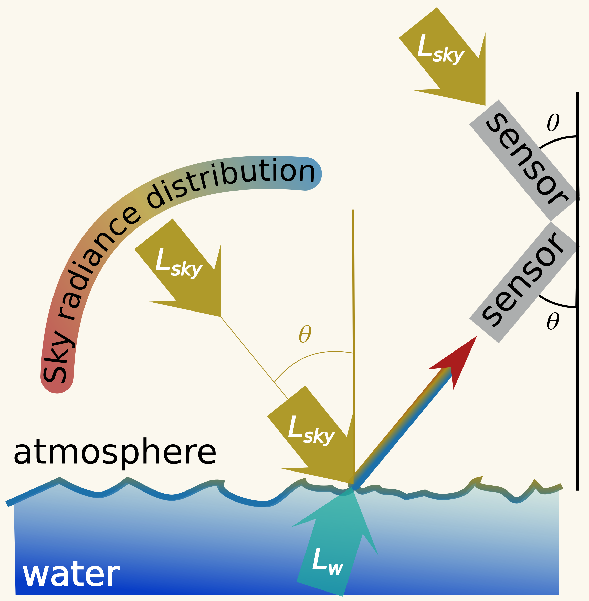
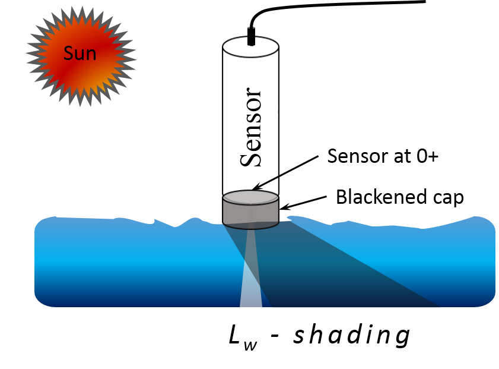
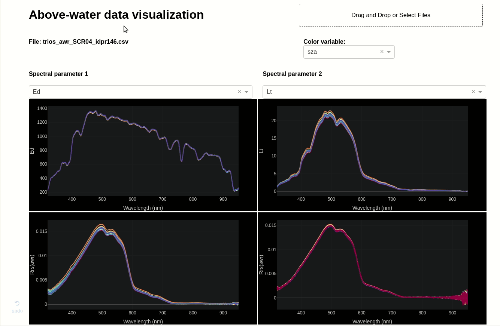

# Water color TriOS package

Package to process TriOS-like radiometer data for various acquisition protocols:
- above-water radiometry




- in-water radiometry

 

- surface-water radiometry



This package also contains tools for interactive visualization of the radiometric data: 



## Getting Started

These instructions will get you a copy of the project up and running on your local machine for development and testing purposes.

### Prerequisites

What things you need to install the software and how to install them

```
Give examples
```

### Installing

A step by step series of examples that tell you how to get a development env running


```
python setup.py install
```

## Running the tests


## Authors

* **Tristan Harmel** - *Initial work* -

See also the list of [contributors](https://github.com/your/project/contributors) who participated in this project.

## License

This project is licensed under the MIT License - see the [LICENSE.md](LICENSE.md) file for details

## Acknowledgments

* Hat tip to anyone whose code was used
* Inspiration
* etc
